 
# Git sever setup instructions
This is a guide that goes along with the main software that walks through the process of setting up a git server. 
Althought the appplication will manage most of the setup automatically, this guide is present in case anything goes wrong. 
In addition, there is a video tutorial [here](https://youtube.com) which also walks through the whole process.

If needed, I can be contacted at [jacob.a.baumel@gmail.com](mailto:jacob.a.baumel@gmail.com) with any questions.

# Step 1: Creating the instance
## Create OCI Account
The first step is to create an account with Oracle Cloud Infrastructure. Go to [cloud.oracle.com](https://cloud.oracle.com)
to begin creating an account. Fill in the email information and verify, and go through all steps to complete the account
creation.

One thing to note about account creation is that the website will ask for a credit card number. This is purely for 
verification purposes, and the CC details are not brought over to the account once it is created. OCI will place a small
 hold on the card to verify your identity, and will release the hold within a few days. Unfortunately, there is no way
around this. The later steps in this setup process _can_ still be performed with other server providers, but all initial
setup will have to be done manually. These exact steps are covered in the above linked video playlist.

## Instance Creation
Once your OCI account is created, the next step is to create the server instance that will host the repositories.
Unfortunately, this process must also be done manually. 

First, click on the pinned "Compute Instances" item on the dashboard:
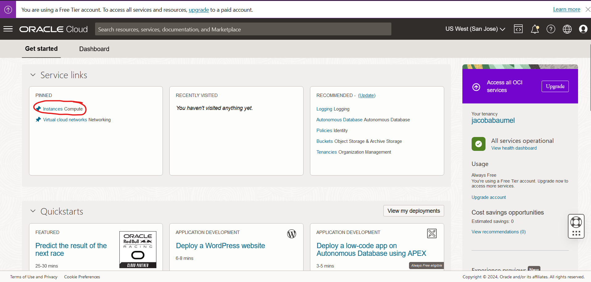

Next, click "Create instance":
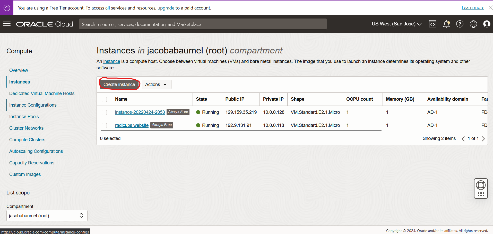

From here, you can name the server whatever you like. This name will not matter in the long term. Under the "Image and 
shape" section, click "Change Image". Select Ubuntu, scroll down, and select "Canonical Ubuntu 22.04 Minimal".

Select Ubuntu:

Select "Canonical Ubuntu 22.04 Minimal":

Save the selection with "Select image". Leave all settings alone for "Primary VNIC information". Under the "Add SSH keys"
section, make sure "Generate a key pair for me" is selected, and **download the private key, and keep track of the file. 
The server is not usable without it.** The file will be named something like "ssh-key-xxxx-xx-xx.key".
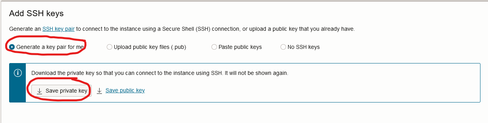

Finally, click "Create" at the bottom of the page to create the instance.
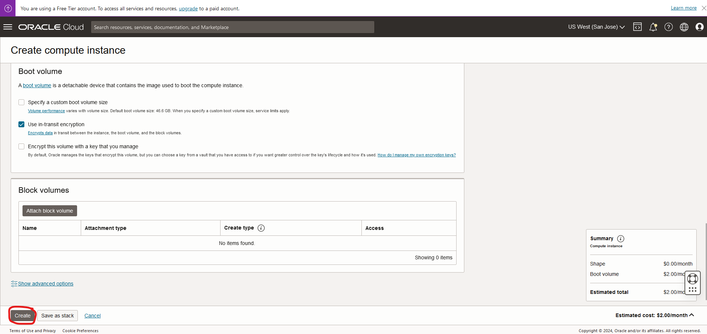

After this, you may have to wait several minutes for the instance to be provisioned and initialized. Under the instance
details page, you will know if the creation was successful by the status light on the left. Also take note of the public
IP address, as you will need this later. Also check the username. This should default to "ubuntu", but if it does not,
take note of what it is.

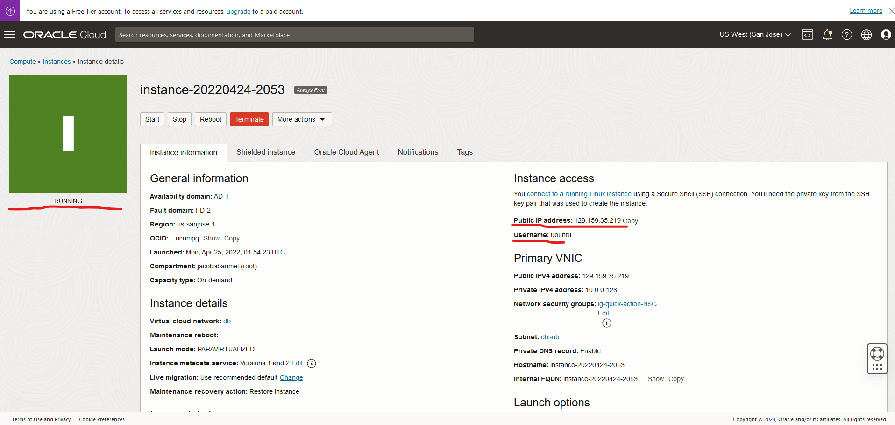

## Storage Block Creation
The next step is to create the additional storage the server will use for storing the repositories. Navigate back to the
home page, click on the hamburger in the top left, go to storage, and click "Block Volumes".

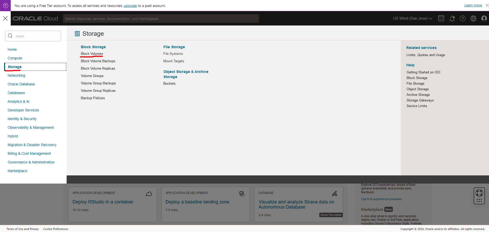

From here, click "Create Block Volume". Name the volume something appropriate,and scroll down to the "Volume size and 
performance" section. Click on custom, and set the "Target volume performance" to 70. 

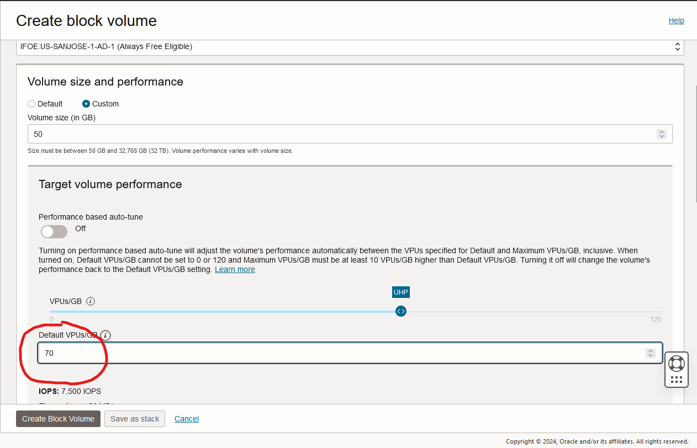

Above that, set the Volume Size to as high as you can go without exceeding the free tier limits. Start at 100GB, and work
your way down until this notice no longer appears:

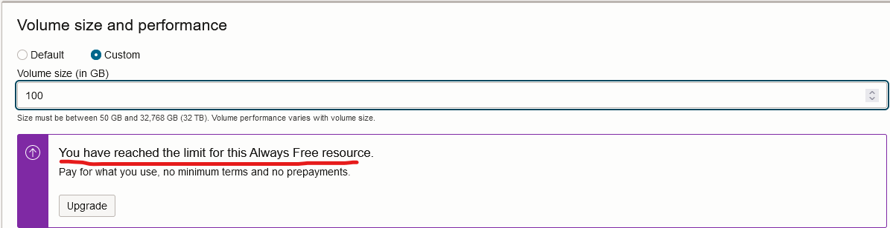

After creating, click in to the details of the block volume, and wait until the volume is finished provisioning. Scroll 
down, and under the resources section, click "Attached instances", and click the "Attach to instance" button. From here,
leave the "Attachment type" on ISCSI and "Access Type" on Read/Write. Under the instance section, choose the instance you
created. Under "Device path", select "/dev/oracleoci/oraclevdb", which should be the first option. Note the last character
in the path is a "b".

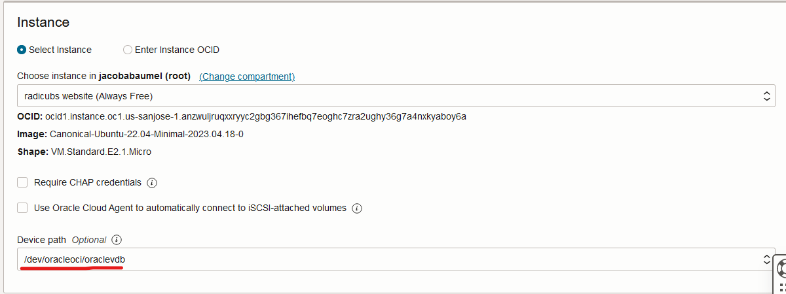

After clicking "Attach", wait for the volume to finish attaching. 

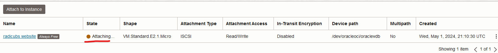

Now click on the 3 dots on the right side of the "Attached Instances" entry for this instance, and click "iSCSI Commands
& Information". A window will pop up that has a variety of commands. There will be 3 commands under the "Attach Commands"
section, and these 3 will need to be copied into the first section of the "Server Management" tab of this application,
in the order they appear.

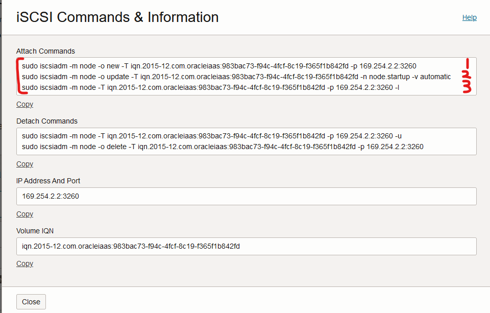

Now, the application will be able to take over the rest of the setup process. Return to the "Server Management" tab to
complete setup.
